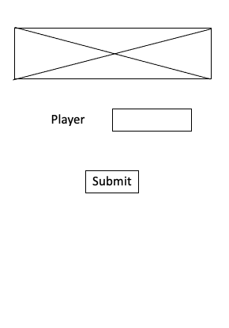
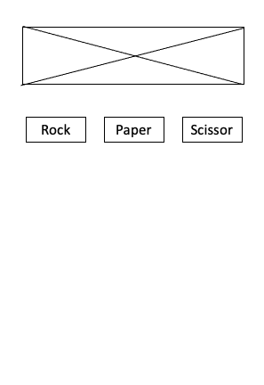
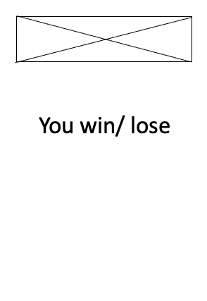

# RPS Challenge

### Acceptance Criteria
```
As a DFAT member
So that I can see my name
I would like to register my name before playing an online game

As a DFAT member
So that I can enjoy myself away from the daily grind
I would like to be able to play rock/paper/scissors
```

## User stories

```
As a DFAT member
So that I can start the game online
I would like to enter my name before playing this game
```
1. test if the name is successfully entered
2. test if the name is successfully logged on the serve

```
As a DFAT member
So that I can know what are the choices
I would like to be presented a rock, paper or scissor
```
1. test if rock, paper or scissor are presented

```
As a DFAT member
So that I can play
I would like to choose one option
```
1. test if I can choose the option I want to choose

```
As an online game system
So that we can decide the winner
I will choose a random option
```
1. test if the system can throw a random option

```
As an online game system
So that we can know who is the winner
I will according to the basic Rules that is Rock beats Scissors, Scissors beats Paper, Paper beats Rock and then declare a winner
```
1. test if the system can determine and declare a winner

## Mockups







## How to run it

`npm install ejs & npm start`

## test


